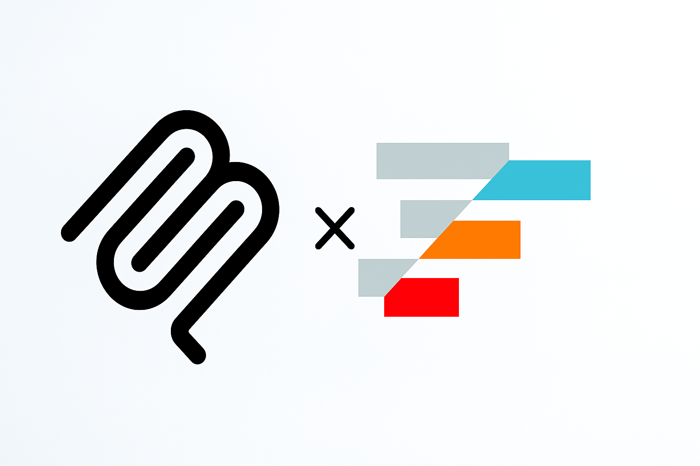

# AG Grid MCP Server



A Model Context Protocol (MCP) server that provides data visualization and manipulation capabilities using AG Grid through headless browser automation. This server enables Claude to create, manipulate, and export data grids with advanced features like sorting, filtering, and statistical analysis.

## Features

### 🚀 Core Capabilities
- **Grid Creation**: Create AG Grid instances with custom column definitions and data
- **Data Management**: Update, filter, and sort grid data dynamically  
- **Export Functionality**: Export grid data as CSV or Excel formats
- **Statistical Analysis**: Generate comprehensive data statistics and summaries
- **Multi-Grid Support**: Manage multiple grid instances simultaneously
- **Resource Access**: Expose grid data and metadata through MCP resources

### 🛠️ Technical Features
- **Headless Browser Automation**: Uses Puppeteer for reliable grid rendering
- **TypeScript**: Fully typed with comprehensive error handling
- **ES Modules**: Modern JavaScript module system
- **MCP Protocol**: Native integration with Claude Desktop
- **Sample Data**: Realistic test datasets for sales, employee, and financial data

## Installation

### Prerequisites
- Node.js 18+ 
- npm or yarn
- Chrome/Chromium browser (automatically handled by Puppeteer)

### Install from Source

```bash
# Clone the repository
git clone <repository-url>
cd mcp-ag-grid

# Install dependencies
npm install

# Build the project
npm run build

# Test the installation
npm test
```

### Install as Package

```bash
# Install globally
npm install -g ag-grid-mcp-server

# Or install locally
npm install ag-grid-mcp-server
```

## Claude Desktop Configuration

### 1. Add to Claude Desktop Config

Edit your Claude Desktop configuration file:

**macOS**: `~/Library/Application Support/Claude/claude_desktop_config.json`
**Windows**: `%APPDATA%\Claude\claude_desktop_config.json`

```json
{
  "mcpServers": {
    "ag-grid": {
      "command": "node",
      "args": ["/path/to/mcp-ag-grid/build/server.js"],
      "env": {
        "NODE_ENV": "production"
      }
    }
  }
}
```

### 2. Alternative: Using npx (if installed globally)

```json
{
  "mcpServers": {
    "ag-grid": {
      "command": "ag-grid-mcp-server"
    }
  }
}
```

### 3. Development Configuration

For development with source maps and debugging:

```json
{
  "mcpServers": {
    "ag-grid": {
      "command": "node",
      "args": ["--enable-source-maps", "/path/to/mcp-ag-grid/build/server.js"],
      "env": {
        "NODE_ENV": "development",
        "DEBUG": "*"
      }
    }
  }
}
```

## Usage Examples

### 1. Creating a Basic Grid

```markdown
Create a sales data grid with the following data:
- Product: iPhone 15, MacBook Pro, iPad Air
- Price: $999, $1999, $599  
- Quantity: 10, 5, 15
- Revenue: calculated field
```

The server will create an AG Grid with sortable, filterable columns and return a grid ID for further operations.

### 2. Data Analysis

```markdown
Generate a statistical summary of the sales grid including:
- Total revenue
- Average price
- Best selling product
- Profit margins by product
```

### 3. Advanced Filtering

```markdown
Apply filters to show only:
- Products with revenue > $5000
- Sales from North America region
- Status = "completed"
```

### 4. Data Export

```markdown
Export the filtered sales data as:
1. CSV format for spreadsheet analysis
2. Excel format with formatting
```

## Available Tools

### `create_grid`
Create a new AG Grid instance with column definitions and data.

**Parameters**:
- `columnDefs`: Array of column definitions
- `rowData`: Array of data objects
- `gridOptions`: Optional additional grid configuration

### `update_grid_data` 
Update data in an existing grid.

**Parameters**:
- `gridId`: Grid identifier
- `rowData`: New data to replace current data

### `apply_grid_filter`
Apply filters to a grid using AG Grid's filter model.

**Parameters**:
- `gridId`: Grid identifier  
- `filterModel`: AG Grid filter configuration

### `export_grid`
Export grid data in specified format.

**Parameters**:
- `gridId`: Grid identifier
- `format`: "csv" or "excel"
- `filename`: Optional custom filename

### `get_grid_stats`
Get comprehensive statistics and current state of a grid.

**Parameters**:
- `gridId`: Grid identifier

### `execute_grid_method`
Execute any AG Grid API method on a grid.

**Parameters**:
- `gridId`: Grid identifier
- `method`: AG Grid API method name
- `params`: Optional method parameters

## Available Resources

### `grid://list`
Lists all active grids with basic metadata.

### `grid://schema/{gridId}`
Returns column definitions and data types for a specific grid.

### `grid://data/{gridId}`
Returns sample data from a grid (first 10 rows) for preview.

### `grid://summary/{gridId}`
Returns comprehensive statistical analysis of grid data.

## Sample Data

The server includes realistic sample datasets:

### Sales Data
- Product information with categories
- Regional sales data
- Revenue and profit calculations
- Customer and sales rep information

### Employee Data  
- HR records with departments
- Salary and compensation data
- Performance ratings
- Manager hierarchies

### Financial Data
- Transaction records
- Account balances
- Merchant and category information
- Credit/debit classifications

Generate sample data:
```bash
npm run sample-data
```

## Development

### Running in Development Mode

```bash
# Start with auto-reload
npm run dev

# Start with debugging
npm run dev:debug

# Run tests in watch mode  
npm run test:watch
```

### Building

```bash
# Development build with source maps
npm run build

# Production build (optimized)
npm run build:prod

# Clean build directory
npm run clean
```

### Testing

```bash
# Run full test suite
npm test

# Run tests in development mode
npm run test:dev

# Validate code and run tests
npm run validate
```

## Troubleshooting

### Common Issues

#### 1. Chrome/Chromium Not Found
```
Error: Could not find Chrome/Chromium
```
**Solution**: Install Chrome or set `PUPPETEER_EXECUTABLE_PATH`:
```bash
export PUPPETEER_EXECUTABLE_PATH=/path/to/chrome
```

#### 2. Permission Denied
```
Error: EACCES: permission denied
```
**Solution**: Ensure the server.js file is executable:
```bash
chmod +x build/server.js
```

#### 3. Module Resolution Errors
```
Error: Cannot find module
```
**Solution**: Ensure all dependencies are installed:
```bash
npm install
npm run build
```

#### 4. Claude Desktop Connection Issues
**Check**:
- Configuration file path is correct
- Server path in config is absolute
- No syntax errors in JSON config
- Restart Claude Desktop after config changes

### Debug Mode

Enable detailed logging:
```bash
DEBUG=* npm run dev
```

Or set environment variables:
```json
{
  "env": {
    "DEBUG": "*",
    "NODE_ENV": "development"
  }
}
```

### Performance Tuning

For better performance:
- Use production build (`npm run build:prod`)
- Limit concurrent grid instances
- Use data sampling for large datasets
- Enable grid virtualization for large row counts

## API Reference

### Grid Configuration

```typescript
interface GridConfig {
  columnDefs: ColumnDef[];
  rowData: Record<string, any>[];
  gridOptions?: Record<string, any>;
}

interface ColumnDef {
  field: string;
  headerName?: string;
  width?: number;
  type?: 'text' | 'number' | 'date' | 'boolean';
  sortable?: boolean;
  filter?: boolean;
  resizable?: boolean;
}
```

### Filter Model Examples

```javascript
// Text filter
{
  columnField: {
    filterType: 'text',
    type: 'contains',
    filter: 'searchTerm'
  }
}

// Number range filter  
{
  columnField: {
    filterType: 'number',
    type: 'inRange',
    filter: 100,
    filterTo: 500
  }
}

// Date filter
{
  columnField: {
    filterType: 'date',
    type: 'greaterThan',
    dateFrom: '2023-01-01'
  }
}
```

## Contributing

1. Fork the repository
2. Create a feature branch
3. Make changes with tests
4. Run `npm run validate`
5. Submit a pull request

## License

ISC License - see LICENSE file for details.

## Support

For issues and questions:
- Create an issue on GitHub
- Check troubleshooting section
- Review AG Grid documentation for advanced features

---

**Built with ❤️ for Claude Desktop integration**
